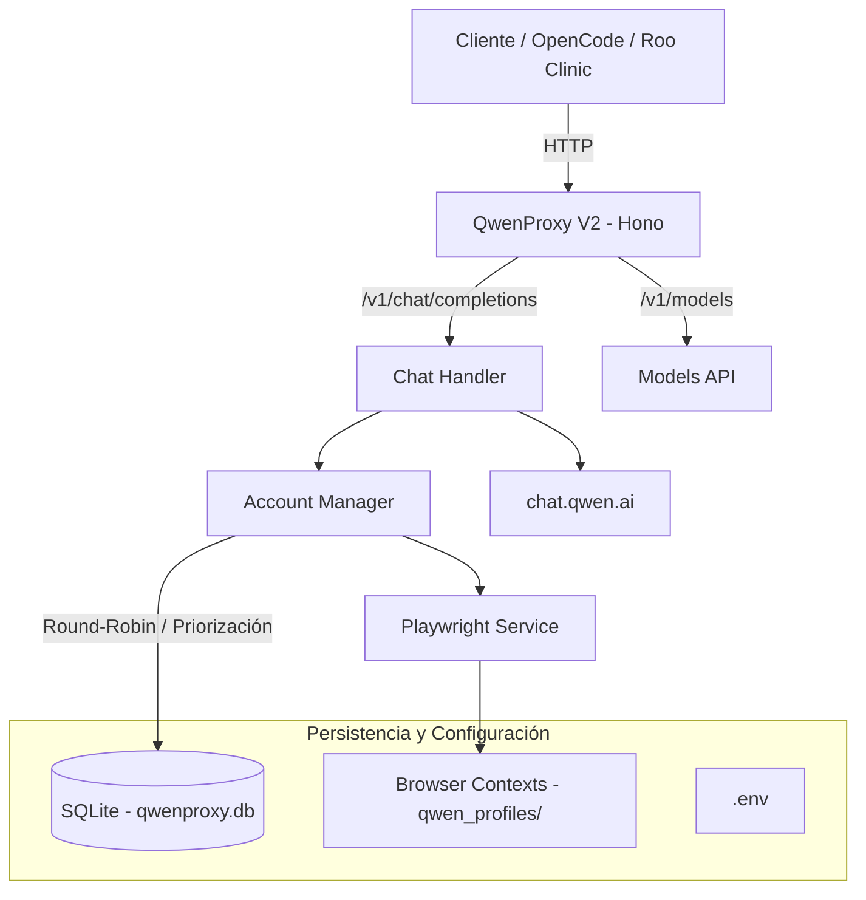

# QwenProxy V2

Proxy API local compatible con OpenAI que enruta peticiones a los modelos oficiales de **Qwen (chat.qwen.ai)** mediante automatización del navegador visible/invisible con Playwright. Soporta rotación de múltiples cuentas con priorización, inicio de sesión interactivo y automatizado, persistencia de cookies de sesión, y almacenamiento local estructurado en base de datos SQLite.

---

## Características principales

- **Compatibilidad con la API de OpenAI** — Interfaz estándar compatible con los endpoints `/v1/chat/completions`, `/v1/models` (con nombres capitalizados `Qwen3.7-Plus`, `Qwen3.7-Max` y capacidades detalladas) y `/v1/upload`.
- **Dashboard Web de Administración** — Interfaz gráfica local e intuitiva accesible en `http://127.0.0.1:3000/admin/` para monitorear el estado en tiempo real.
- **Gestión de Cuentas Interactiva** — Añade cuentas y gestiona inicios de sesión de manera visual usando Playwright interactivo con **extracción pasiva de correo real** y consolidación de cookies en disco, previniendo expiraciones prematuras y bloqueos anti-bot.
- **Arranque Secuencial Resiliente** — Si la base de datos de cuentas está vacía, el servidor arranca limpiamente sin errores fatales, permitiendo el ingreso inmediato a la web para registrarlas.
- **Auto-registro Inicial** — Registra de manera silenciosa y automática la primera cuenta en SQLite utilizando las credenciales configuradas en tu archivo `.env` (`QWEN_EMAIL` y `QWEN_PASSWORD`).
- **Conteo de Tokens por Modelo** — Registra y reporta de forma independiente en el dashboard los tokens utilizados por cada modelo (`Qwen3.7-Plus` y `Qwen3.7-Max`) en la base de datos local.
- **Espejado de Logs Seguro** — Todos los logs del backend (`console.log/warn/error`) se interceptan y redirigen en tiempo real al panel web administrativo.
- **Persistencia de Sesiones** — El proxy almacena y recupera las cookies de sesión del navegador en carpetas aisladas por ID de cuenta en `qwen_profiles/`.
- **Modo Convidado (Guest Mode)** — Modo de uso sin necesidad de login mediante la API pública de Qwen (cuando se habilita en configuración).
- **Selección de Navegador** — Posibilidad de alternar entre Chromium, Firefox, Google Chrome o Microsoft Edge.
- **Independencia de Recursos** — Proyecto 100% independiente y local escrito en Node.js y TypeScript. No requiere ejecutables o binarios externos de terceros.

---

## Arquitectura



---

## Requisitos previos

| Dependencia | Versión Mínima | Instala con |
|-------------|----------------|--------------|
| **Node.js** | v20.x o superior | [nvm](https://github.com/nvm-sh/nvm) |
| **npm**     | v9.x o superior | Incluido con Node.js |
| **Playwright**| Integrado | Autoinstalable por `install.bat` |

---

## Instalación y Arranque

### Opción 1: Instalación Rápida (Windows)
1. Haz doble clic en el archivo `install.bat` en el directorio raíz.
2. El script instalará automáticamente las dependencias, configurará tu archivo `.env`, descargará Chromium y compilará el código fuente.
3. Al finalizar, te preguntará si deseas arrancar el proxy e ingresar al panel administrativo directamente.

### Opción 2: Instalación Manual
1. **Instalar dependencias del proyecto:**
   ```bash
   npm install
   ```
2. **Descargar los navegadores de Playwright:**
   ```bash
   npx playwright install chromium

   npx playwright install
   ```
3. **Compilar el backend y frontend:**
   ```bash
   npm run build
   ```
4. **Arrancar el servidor en producción:**
   ```bash
   npm start
   ```

---

## Configuración Detallada (.env)

Crea un archivo `.env` en la raíz del proyecto basándote en el archivo `.env.example`:

| Variable | Tipo / Defecto | Descripción |
|----------|----------------|-------------|
| `PORT` | `3000` | Puerto local en el que escuchará la API y el Dashboard. |
| `HOST` | `0.0.0.0` | Host del servidor. |
| `API_KEY` | *(Opcional)* | Clave de API del Proxy. Déjala vacía para permitir peticiones sin autenticación. |
| `QWEN_EMAIL` | *(Opcional)* | Correo de la primera cuenta Qwen (para registro automático al arrancar). |
| `QWEN_PASSWORD` | *(Opcional)* | Contraseña de la cuenta Qwen (para registro automático al arrancar). |
| `QWEN_GUEST_MODE_ONLY`| `false` | Activar para saltarse el pool de cuentas y usar solo el modo invitado sin login. |
| `BROWSER` | `chromium` | Navegador a usar (`chromium`, `firefox`, `chrome`, `edge`). |
| `HEADLESS` | `true` | Ejecutar el navegador en segundo plano (invisible). |
| `USER_DATA_DIR` | `./qwen_profiles` | Directorio local donde se guardarán las cookies y perfiles de navegador. |
| `WARM_POOL_SIZE` | `0` | Tamaño de la piscina de chats pre-creados para acelerar las respuestas. |

---

## Gestión de Cuentas desde el Dashboard

Al acceder a `http://127.0.0.1:3000/admin/`, dispones de las siguientes opciones visuales:
- **Agregar Cuenta (Manual/Interactiva):** Abre una ventana de Playwright visible donde podrás autenticarte con tu cuenta de Qwen (incluso vía Google o OAuth). Tras iniciar sesión con éxito, la sesión se guardará en disco y se añadirá al pool de rotación.
- **Priorización:** Mueve las cuentas hacia arriba o hacia abajo en la cola para ordenar la precedencia en la rotación de llamadas de la API.
- **Métricas de Tokens:** Monitorea cuántos tokens has consumido de forma separada los modelos `qwen3.7-plus` y `qwen3.7-max` en cada cuenta.
- **Logs en tiempo real:** Abre el visor de Logs del backend para depurar el comportamiento del proxy directamente en la web.

---

## Rutas del Servidor API

El servidor expone los siguientes endpoints para su consumo:

| Rota | Método | Descripción |
|------|--------|-----------|
| `/v1/chat/completions` | POST | Generaciones de chat compatibles con OpenAI (soporta streaming SSE y no-streaming). |
| `/v1/chat/completions/stop` | POST | Cancela y aborta una llamada de generación activa. |
| `/v1/models` | GET | Listado de modelos soportados (`qwen3.7-plus` y `qwen3.7-max`). |
| `/v1/models/:model` | GET | Información detallada de un modelo específico. |
| `/v1/upload` | POST | Carga archivos multimodales (imágenes, audios, videos y documentos) a los servidores de Qwen. |
| `/health` | GET | Health check de la API. |
| `/metrics` | GET | Métricas del sistema en formato Prometheus. |

---

## Ejemplos de Integración

### Cliente de OpenAI (Node.js SDK)
```typescript
import OpenAI from 'openai';

const openai = new OpenAI({
  baseURL: 'http://localhost:3000/v1',
  apiKey: 'sk-local' // O tu API_KEY del archivo .env
});

const completion = await openai.chat.completions.create({
  model: 'qwen3.7-max',
  messages: [{ role: 'user', content: 'Explícame qué es Playwright en una oración.' }],
  stream: false
});

console.log(completion.choices[0].message.content);
```

### cURL (Streaming)
```bash
curl http://localhost:3000/v1/chat/completions \
  -H "Content-Type: application/json" \
  -H "Authorization: Bearer sk-local" \
  -d '{
    "model": "qwen3.7-plus",
    "messages": [{"role": "user", "content": "¡Hola Qwen!"}],
    "stream": true
  }'
```

---

## Despliegue con Docker

### docker-compose.yml
```yaml
services:
  qwenproxy:
    build: .
    container_name: qwenproxyv2
    ports:
      - "${PORT:-3000}:3000"
    env_file:
      - .env
    volumes:
      - ./data:/app/data               # Base de datos SQLite
      - ./qwen_profiles:/app/qwen_profiles  # Sesiones de Playwright
    restart: unless-stopped
    logging:
      driver: "json-file"
      options:
        max-size: "10m"
        max-file: "3"
```

### Volumes persistentes
- `./data` — Almacena la base de datos `qwenproxy.db` que registra las cuentas y tokens acumulados.
- `./qwen_profiles` — Almacena los directorios de perfiles del navegador para mantener las sesiones de login vigentes.

---

## Estratificación del Proyecto

```
qwenproxy_v2/
├── bin/
│   └── qwenproxy.mjs            # Entry point de la interfaz CLI binaria
├── frontend/                    # Panel administrativo local (React + Vite)
│   ├── src/
│   │   ├── components/          # Componentes visuales (Accounts, Logs, API)
│   │   └── hooks/               # Custom hooks de React para consumir endpoints
│   └── index.html               # Plantilla HTML principal (QwenProxy V2)
├── src/
│   ├── index.ts                 # Inicializador y arranque de Hono
│   ├── login.ts                 # Lógica auxiliar de login
│   ├── api/
│   │   ├── models.ts            # Definición del endpoint de listado de modelos
│   │   └── server.ts            # Servidor y auto-apertura del navegador
│   ├── core/
│   │   ├── account-manager.ts   # Enrutador round-robin y cooldowns de cuentas
│   │   ├── accounts.ts          # CRUD de cuentas en SQLite
│   │   ├── config.ts            # Validador de esquemas de entorno Zod
│   │   ├── crypto-utils.ts      # Encriptador AES de contraseñas de cuentas
│   │   └── database.ts          # Gestión de base de datos SQLite y migraciones
│   ├── routes/
│   │   ├── admin.ts             # Enrutador REST para la UI de administración
│   │   ├── chat.ts              # Endpoint compatible /v1/chat/completions
│   │   ├── stream-handler.ts    # Orquestador del flujo streaming SSE
│   │   └── upload.ts            # Endpoint compatible /v1/upload
│   └── services/
│       ├── browser-manager.ts   # Ciclo de vida y almacenamiento de Playwright
│       ├── playwright.ts        # Fachada y métodos unificados del navegador
│       ├── stream-creator.ts    # Generador de chats y streams de Qwen
│       └── warm-pool.ts         # Pool de precalentamiento de conversaciones
├── data/                        # Base de datos SQLite local (Git Ignored)
└── qwen_profiles/               # Cookies e historiales Playwright (Git Ignored)
```

---

## Troubleshooting (Solución de problemas)

| Problema | Solución |
|----------|---------|
| **La pestaña del navegador no abre** | Asegúrate de tener los navegadores instalados ejecutando `npx playwright install chromium`. |
| **Sesión expirada o bienvenida persistente**| Ve al Dashboard, selecciona la cuenta y vuelve a iniciar sesión con el navegador interactivo para refrescar las cookies. |
| **Rate limits o cooldowns en cuentas** | Añade cuentas adicionales al pool de rotación para mitigar la carga de peticiones concurrentes. |
| **Base de datos corrompida** | Si SQLite da errores severos de lectura, borra el archivo `data/qwenproxy.db`. El proxy creará uno nuevo automáticamente al iniciar. |

---

## Disclaimer

> Este proyecto se proporciona estrictamente con fines educativos y de investigación.

Los desarrolladores no incentivan, promueven ni se responsabilizan de:
- La violación de los Términos de Servicio oficiales de la plataforma Qwen.
- La automatización no autorizada a gran escala.
- El uso indebido o malintencionado del software.

**Utilízalo bajo tu propia responsabilidad.**
